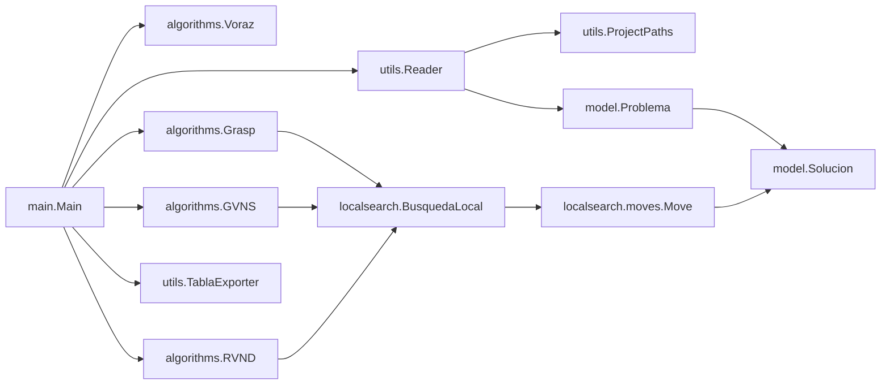

# Práctica 5 — DAA

**Asignatura:** Diseño y Análisis de Algoritmos (DAA)  
**Práctica:** Metaheurísticas / Búsqueda Local  
**Instancias:** `wlp01.dzn`–`wlp05.dzn` (carpeta `instances/Public/`)  
**Salida de resultados:** carpeta `tablas/` (exportación automática)  

> Nota: este informe describe la implementación real del proyecto (clases, algoritmos y tablas generadas), y resume los resultados exportados en modo *Estudio* para `wlp01`–`wlp05`.

---

## 1. Descripción del problema

El proyecto resuelve una variante del **Warehouse Location / Facility Location Problem** con:

- **Instalaciones (warehouses)** con:
  - capacidad `cap_j`
  - coste fijo de apertura `f_j`
- **Clientes (stores)** con:
  - demanda `d_i`
- **Coste de transporte** `c_{ij}` por unidad suministrada desde instalación `j` al cliente `i`.
- **Incompatibilidades** entre pares de clientes: si `(i,k)` es incompatible, **no pueden ser servidos desde la misma instalación**.

### 1.1. Variables y función objetivo
Se modela un suministro (flujo) `x_{ij}` (tipo `double` en la implementación):

- `x_{ij} ≥ 0`: cantidad de demanda del cliente `i` suministrada desde la instalación `j`.
- Una instalación se considera **abierta** si existe algún `i` tal que `x_{ij} > 0`.

**Función objetivo** (minimización):

\[
\min \sum_{j \in J} f_j\, y_j + \sum_{i \in I}\sum_{j \in J} c_{ij} \, x_{ij}
\]

con `y_j ∈ {0,1}` indicando si la instalación `j` está abierta.

### 1.2. Restricciones
- **Satisfacción de demanda** (multisource):
\[
\sum_{j \in J} x_{ij} = d_i \quad \forall i
\]
- **Capacidad**:
\[
\sum_{i \in I} x_{ij} \le cap_j \quad \forall j
\]
- **Incompatibilidades**: si `i` y `k` son incompatibles, no pueden coexistir en una instalación:
\[
\forall j: \; (\exists\, x_{ij} > 0) \land (\exists\, x_{kj} > 0) \Rightarrow (i,k) \text{ compatible}
\]

---

## 2. Estructura del proyecto y arquitectura

El código está organizado por paquetes:

- `model/`: entidades del problema y representación de soluciones.
- `utils/`: lectura de instancias, menú, rutas del proyecto y exportación de tablas.
- `algorithms/`: constructivas y metaheurísticas (Voraz, GRASP, GVNS, RVND).
- `localsearch/` y `localsearch/moves/`: vecindades y movimientos con cálculo de Δ-coste.
- `main/`: orquestación de ejecución y exportación.

### 2.1. Diagrama de dependencias (alto nivel)



### 2.2. Clases principales

#### `model.Problema`
Responsabilidad: almacenar los datos de la instancia y centralizar la lógica de compatibilidad.

- `double[][] costosTransporte`: matriz `c_{ij}` (fila cliente, columna instalación).
- `boolean[][] incompatibilidades` + `BitSet[] incompatiblesCon`: estructura acelerada para comprobar incompatibilidades.
- `boolean esCompatible(Solucion sol, int clienteId, int instalacionId)`:
  - ruta rápida con `BitSet.intersects(...)` sobre `sol.getClientesEnInstalacion(instalacionId)`.

**Idea clave:** la compatibilidad se resuelve sin recorrer todos los clientes (evita un O(n) directo), usando intersección de bitsets.

#### `model.Solucion`
Representación de la solución y mantenimiento incremental del coste.

- `double[][] suministros`: `x_{ij}`.
- `boolean[] instalacionesAbiertas`.
- `double[] capacidadRestante`.
- `BitSet[] clientesEnInstalacion`: para cada instalación, qué clientes tienen suministro positivo.
- `double costeTotal`: se actualiza **incrementalmente**.

Métodos críticos:
- `añadirSuministro(i,j,q)`:
  - abre instalación si estaba cerrada (suma coste fijo), actualiza capacidad, marca cliente en bitset, suma coste variable `q*c_{ij}`.
- `quitarSuministro(i,j,q)`:
  - resta coste variable, resta carga, si queda sin suministro para ese cliente lo elimina del bitset.
  - si una instalación queda vacía, la cierra y resta su coste fijo.

**Resultado:** evaluar un movimiento es más barato (no hay que recalcular el coste completo).

#### `utils.Reader`
Lee instancias `.dzn` (MiniZinc-like):
- tamaños: `Warehouses`, `Stores`
- arrays: `Capacity`, `FixedCost`, `Goods`
- matriz: `SupplyCost`
- incompatibilidades: pares `a,b` (asumiendo índices 1-based → se resta 1).

Además incluye resolución robusta de rutas vía `ProjectPaths` (importante cuando el *working directory* cambia).

#### `main.Main`
Orquesta ejecución y exportación:
- pregunta configuración por consola (`utils.Menu` → `MenuConfig`).
- carga cada instancia con `Reader`.
- ejecuta solución inicial (Voraz o GRASP).
- ejecuta metaheurística (GVNS o RVND).
- exporta tablas `Tabla1..Tabla12` según corresponda.

---

## 3. Búsqueda local basada en movimientos (Δ-coste)

En este proyecto la búsqueda local no “toca” la solución a ciegas: primero **evalúa** movimientos candidatos con un **Δ-coste** y sólo si el Δ es realmente negativo (mejora) lo aplica.

La idea general es:

1) Tengo una solución actual `sol`.
2) Elijo una vecindad (Shift, SwapClientes, SwapInstalaciones, ...).
3) Esa vecindad explora su conjunto de movimientos factibles y devuelve el mejor.
4) Se calcula `delta = nuevoCoste - costeActual`.
5) Si `delta < -EPS`, se aplica el movimiento.

Esto es importante por dos motivos:

- **Eficiencia:** el coste total no se recalcula desde cero; se trabaja con deltas.
- **Corrección:** la factibilidad (capacidad + incompatibilidades) se verifica antes de aplicar.

### 3.1. Dos piezas: `BusquedaLocal` y `Move`

#### 3.1.1. Qué es una vecindad (`BusquedaLocal`)

Una vecindad es una estrategia que sabe:

- qué significa “moverse” desde una solución (qué tipos de cambios permite)
- cómo encontrar el mejor cambio posible (o determinar que no hay ninguno)

Su contrato es:

```java
Optional<Move> encontrarMejorMovimiento(Solucion sol, Problema problema);
```

Si no existe un movimiento factible, devuelve `Optional.empty()`.

#### 3.1.2. Qué es un movimiento (`Move`)

Un movimiento es un objeto que representa una acción concreta (por ejemplo “mover 40 unidades del cliente 7 de la instalación 3 a la 10”).

Su contrato es:

```java
double delta(Problema problema, Solucion sol);
void apply(Solucion sol);

- `delta(...)` calcula **cuánto cambia la función objetivo** si aplicáramos el movimiento.
- `apply(...)` aplica el cambio usando `Solucion.añadirSuministro/quitarSuministro`.

### 3.2. Cómo se aplica “una” mejora (paso a paso)

El método clave es `BusquedaLocal.aplicarMejorMovimiento(...)`, que hace exactamente esto:

1) Pide el mejor movimiento a la vecindad: `m = encontrarMejorMovimiento(...)`.
2) Si `m` no existe: no hay mejora → devuelve `false`.
3) Si existe: calcula `delta = m.delta(...)`.
4) Si `delta < -EPS`: aplica `m.apply(sol)` y devuelve `true`.
5) Si no: no aplica nada (aunque exista un movimiento con delta casi 0) y devuelve `false`.

**Por qué existe `EPS = 0.001`:**

- Trabajamos con `double` y puede haber ruido numérico.
- Evitamos aceptar una “mejora” minúscula que no es real (o que luego se deshace por redondeo).

### 3.3. Por qué el Δ-coste funciona (lógica detrás)

La función objetivo es:

\[
	ext{Coste} = \underbrace{\sum_j f_j\,y_j}_{\text{fijos}} + \underbrace{\sum_{i,j} c_{ij}\,x_{ij}}_{\text{variables}}
\]

Un movimiento sólo cambia una parte pequeña de `x_{ij}` (y a veces el estado abierto/cerrado de una instalación). Por eso el Δ-coste se puede calcular sin recomputar todo:

- **Δ variable:** depende sólo de los arcos (i,j) que cambian.
- **Δ fijo:** depende sólo de si alguna instalación pasa de cerrada→abierta o abierta→cerrada.

En la implementación, el coste fijo se gestiona automáticamente porque:

- `añadirSuministro(...)` abre la instalación si estaba cerrada y suma el fijo.
- `quitarSuministro(...)` cierra la instalación si queda vacía y resta el fijo.

Así, si el movimiento está bien calculado y luego se aplica, el coste total queda consistente.

### 3.4. Vecindades implementadas (con detalle)

#### 3.4.1. `Shift` (mover suministro de un cliente)

**Qué intenta:**
mover una cantidad `q` del cliente `i` desde una instalación origen `j1` a una destino `j2`.

**Cómo se explora (paso a paso):**

1) Recorre todos los clientes `i`.
2) Para cada `i`, recorre todas las instalaciones `j1`.
3) Si `sol.suministros[i][j1] = q > 0`, significa que hay algo que mover.
4) Prueba todos los destinos `j2 != j1`:
  - verifica capacidad: `capRestante[j2] >= q`
  - verifica incompatibilidades: `problema.esCompatible(sol, i, j2)`
5) Para cada candidato factible, construye un `ShiftMove` y calcula su `delta`.
6) Se queda con el `ShiftMove` de menor delta (el más negativo).

**Cómo calcula `ShiftMove.delta(...)`:**

1) Δ transporte:
\[
\Delta_{var} = q\,(c_{i,j2} - c_{i,j1})
\]
2) Δ fijo:
- si `j2` estaba cerrada y al añadir se abre: `+f_{j2}`
- si `j1` queda vacía tras quitar `q`: `-f_{j1}`

La comprobación “¿queda vacía `j1`?” se hace con `MoveUtils.wouldBecomeEmptyAfterRemoving(...)`, que mira si quedaría algún suministro positivo en esa instalación.

**Por qué funciona:**
Shift es una vecindad de **intensificación local**: explora movimientos simples que suelen bajar rápido el coste variable, y además puede “reorganizar” aperturas/cierres por el término fijo.

#### 3.4.2. `SwapClientes` (swap del suministro principal)

**Qué intenta:**
para dos clientes `i1` e `i2`, identifica:

- `j1`: instalación donde `i1` recibe su mayor suministro (su “principal”)
- `j2`: instalación donde `i2` recibe su mayor suministro

y propone intercambiar esas dos asignaciones.

**Paso a paso de la vecindad:**

1) Para cada cliente `i1`, calcula su instalación principal `j1`.
2) Para cada `i2 > i1`, calcula su principal `j2`.
3) Si `j1 == j2`, el swap no tiene sentido (lo descarta).
4) Comprueba factibilidad con `esFactibleSwap(...)`.
5) Si es factible, crea un `SwapClientesMove` y evalúa delta (en este movimiento el delta es sólo de transporte).
6) Retorna el movimiento con menor delta.

**Cómo se comprueba factibilidad (la parte importante):**

Esta vecindad hace una simulación “destructiva” pero controlada sobre la propia solución para comprobar capacidad/compatibilidad:

1) Quita `q1` de `(i1,j1)` y `q2` de `(i2,j2)`.
2) Comprueba si ahora caben las cantidades cruzadas:
  - `capRestante[j1] >= q2` y `capRestante[j2] >= q1`
3) Comprueba compatibilidad tras haber quitado:
  - `esCompatible(sol, i1, j2)` y `esCompatible(sol, i2, j1)`
4) Restaura la solución exactamente como estaba (añade de vuelta lo que quitó).

Esa “quita y restaura” es un **mini-rollback manual**.

**Por qué funciona:**
SwapClientes permite escapar de mínimos locales donde Shift ya no mejora: a veces no conviene mover un cliente entero, pero sí intercambiar “quién usa qué instalación” para redistribuir costes.

#### 3.4.3. `SwapInstalaciones` (cerrar una instalación y recolocar)

Es la vecindad más compleja porque un “movimiento” no es una única operación: puede implicar quitar y añadir muchos suministros.

**Objetivo:**

- Elegir una instalación abierta `jOpen` para cerrarla.
- Probar una instalación cerrada `jClosed` como sustituta.
- Reasignar toda la carga de `jOpen` a `jClosed` y/o a otras abiertas.

**Ideas clave:**

1) Se construye un `CompositeMove` con una lista de operaciones atómicas.
2) Para evaluar factibilidad y delta, la vecindad **simula** aplicar esas operaciones sobre la solución.
3) Al terminar la simulación, **deshace** todo con rollback (para dejar la solución intacta), y sólo si es viable devuelve el movimiento.

##### (A) Poda rápida por capacidad

Antes de simular nada, se calcula:

- `cargaOpen`: suma de `x_{i,jOpen}` para los clientes afectados.
- `disponible`: capacidad restante de `jClosed` (está cerrada) + capacidades restantes de las abiertas (excepto `jOpen`).

Si `disponible < cargaOpen`, se descarta el par (`jOpen`, `jClosed`) sin simular.

##### (B) Simulación de reasignación (paso a paso)

Para cada cliente `i` que recibe suministro desde `jOpen`:

1) Quitar de `jOpen` la cantidad `cantidadAMover = x_{i,jOpen}`.
2) Intentar asignar a `jClosed` tanto como se pueda si:
  - es compatible
  - tiene capacidad
3) Si queda demanda por recolocar, repartirla por instalaciones ya abiertas (distintas de `jOpen`) que sean compatibles y tengan capacidad.
4) Si al final todavía queda demanda sin asignar → movimiento no factible.
5) Cuando todos los clientes se recolocan, la instalación `jOpen` debería quedar vacía, y por tanto se cierra automáticamente en `Solucion.quitarSuministro(...)`.

##### (C) Rollback: cómo y por qué

Durante la simulación se van guardando operaciones `Operation(clienteId, instalacionId, cantidad, esAdd)`.

- Si `esAdd=true`, se hizo `añadirSuministro`.
- Si `esAdd=false`, se hizo `quitarSuministro`.

El rollback se hace recorriendo la lista en orden inverso:

- si la operación fue un add → se deshace con `quitarSuministro`
- si la operación fue un remove → se deshace con `añadirSuministro`

Esto deja la solución exactamente igual que al inicio de la evaluación, permitiendo:

- comparar candidatos sin contaminar el estado
- evaluar muchos movimientos sin necesidad de clonar matrices grandes

##### (D) Cálculo del delta en `SwapInstalaciones`

El delta se calcula como:

1) Δ transporte: suma de lo que se añade y se quita (precomputado con la lista de operaciones).
2) Δ fijo:
- siempre se resta `f_{jOpen}` (porque se cierra)
- y se suma `f_{jClosed}` si realmente se llegó a usar (se detecta si hubo alguna operación add hacia `jClosed`).

El movimiento devuelto es un `CompositeMove` cuyo `delta(...)` devuelve el valor precomputado.

**Por qué funciona:**
es una vecindad “grande” que ataca la parte fija del coste (cerrar instalaciones caras) mientras intenta recolocar sin violar restricciones.

#### 3.4.4. `EliminarIncompatibilidad`

**Qué intenta (lógica):**

1) Busca la instalación abierta con mayor coste total aproximado (fijo + transporte de lo que sirve).
2) Dentro de esa instalación, elige un cliente “problemático” (con más incompatibilidades globales).
3) Intenta mover todo su suministro a otra instalación ya abierta (manteniendo el criterio original), mediante un `ShiftMove`.

Aunque en nuestras ejecuciones finales la solución no tiene incompatibilidades (`Tabla6` marca ✓OK), esta vecindad está diseñada para reducir conflictos cuando existan.

---

## 4. Algoritmos implementados

### 4.1. Voraz (constructivo)
Clase: `algorithms.Voraz`

- Recorre clientes en orden.
- Mientras un cliente tenga demanda restante, elige la instalación factible con menor “pseudo-coste”:
  - coste variable `c_{ij}`
  - penalización si la instalación está cerrada: `f_j / cap_j`.
- Permite multisource: un cliente puede dividirse en varias instalaciones.

### 4.2. GRASP
Clase: `algorithms.Grasp`

Itera múltiples construcciones aleatorizadas:

1) **Fase constructiva**: para cada asignación, se construye una lista de candidatos ordenada por pseudo-coste y se elige aleatoriamente dentro de la **LRC** (lista restringida de candidatos).
2) **Mejora local**: aplica las búsquedas locales básicas (`Shift`, `SwapClientes`) una vez por iteración.
3) Se conserva la mejor solución global.

Parámetro principal:
- `|LRC|` (tamaño de la lista restringida).

### 4.3. RVND
Clase: `algorithms.RVND`

RVND (Randomized Variable Neighborhood Descent) implementa un descenso que alterna vecindades de manera aleatoria para no sesgarse siempre hacia el mismo tipo de movimiento.

#### 4.3.1. Flujo completo (paso a paso)

La implementación sigue exactamente esta lógica:

1) `actual = copia(solucionInicial)`.
2) `disponibles = [todas las vecindades]`.
3) Mientras `disponibles` no esté vacía:
  1. elegir aleatoriamente un índice `idx`.
  2. `bl = disponibles[idx]`.
  3. generar candidata: `candidata = bl.mejorar(actual, problema)`.
    - `mejorar` clona `actual` y aplica como máximo 1 movimiento.
  4. si `candidata` mejora de verdad (`candidata.coste < actual.coste - 0.001`):
    - aceptar: `actual = candidata`
    - reiniciar lista: `disponibles = [todas]`.
  5. si no mejora:
    - eliminar esa vecindad del ciclo actual: `disponibles.remove(idx)`.

#### 4.3.2. Por qué RVND “funciona”

- Si una vecindad no mejora en el estado actual, puede que otra sí (p. ej. Shift no mejora pero SwapInstalaciones sí).
- Reiniciar la lista cuando hay mejora fuerza una **búsqueda intensiva** alrededor del nuevo mínimo local, probando de nuevo todas las vecindades.
- El orden aleatorio introduce diversidad sin necesidad de parámetros adicionales.

### 4.4. GVNS-RL (GVNS con aprendizaje por refuerzo)
Clase: `algorithms.GVNS`

GVNS (General Variable Neighborhood Search) es una metaheurística que alterna:

- **diversificación:** perturbar la solución (salir del mínimo local)
- **intensificación:** aplicar un descenso (RVND) para “caer” a un nuevo mínimo local

En nuestro caso, el descenso interno es un RVND con selección de vecindades guiada por pesos (*reinforcement learning* simple).

#### 4.4.1. Estructura general de GVNS (paso a paso)

La implementación trabaja con:

- `mejorGlobal`: mejor solución encontrada hasta ahora.
- `k`: intensidad actual de perturbación (entre 1 y `kmax`).
- `iteracionesSinMejora`: contador para parar cuando GVNS se estanca.

El bucle principal es:

1) Inicializar `mejorGlobal = copia(solInicial)`.
2) `k = 1`.
3) Mientras `iteracionesSinMejora < iteracionesMaximas`:
  1. **Shaking:** `solPerturbada = perturbar(mejorGlobal, k)`.
  2. **Descenso:** `solMejorada = rvndConReinforcementLearning(solPerturbada)`.
  3. **Aceptación:**
    - si `solMejorada` mejora a `mejorGlobal`:
      - aceptar: `mejorGlobal = copia(solMejorada)`
      - reset: `k = 1` y `iteracionesSinMejora = 0`
    - si no mejora:
      - aumentar perturbación: `k = (k % kmax) + 1`
      - `iteracionesSinMejora++`

**Intuición:** si no mejoras, intentas escapar más fuerte del mínimo local (subes `k`). Si mejoras, vuelves a perturbar suave (k=1) alrededor del nuevo mejor.

#### 4.4.2. Shaking `perturbar(sol, k)` (detalle)

Objetivo del shaking: romper parte de la estructura de la solución para permitir que el descenso encuentre un mínimo local distinto.

Para `p = 1..k`:

1) Elige un cliente aleatorio `clienteAleatorio`.
2) **Destrucción:**
  - recorre instalaciones `j`
  - si `x_{cliente,j} > 0`, lo quita todo con `quitarSuministro(cliente,j,cant)`.
3) **Reconstrucción voraz:**
  - `demandaRestante = d_cliente`
  - mientras `demandaRestante > 0`:
    1. busca la mejor instalación `mejorJ` factible (capacidad>0 y compatible)
    2. usa como score el coste variable y una penalización si la instalación está cerrada
    3. asigna `asig = min(demandaRestante, capRestante[mejorJ])`
    4. actualiza `demandaRestante -= asig`

Si no existe ninguna instalación factible (`mejorJ == -1`), el método corta la reconstrucción para ese cliente.

#### 4.4.3. Descenso: `rvndConReinforcementLearning(sol)`

Este método es un RVND, pero en lugar de elegir vecindad uniformemente al azar, usa una **ruleta ponderada**.

##### (A) Inicialización

1) `actual = copia(sol)`.
2) `entornosDisponibles = [0..m-1]` (índices de vecindades).
3) `pesosRL[i]` empieza en 1.0 para todas las vecindades.

##### (B) Bucle RVND-RL (paso a paso)

Mientras queden entornos disponibles:

1) Selecciona `indiceEntorno` por ruleta:
  - suma pesos de los disponibles
  - toma un valor aleatorio en `[0, suma)`
  - recorre acumulando hasta superar el aleatorio
2) `bl = entornos[indiceEntorno]`.
3) Intenta mejorar *in place*:
  - `mejora = bl.aplicarMejorMovimiento(actual, problema)`
  - esto aplica como máximo 1 movimiento.
4) Si `mejora`:
  - refuerzo positivo: `pesosRL[indiceEntorno] += 1.0`
  - reiniciar entornos disponibles (como en RVND): vuelve a permitir probar todas.
5) Si no mejora:
  - refuerzo negativo: `pesosRL[indiceEntorno] = max(0.1, pesosRL[indiceEntorno] * 0.9)`
  - elimina ese entorno del ciclo actual.

##### (C) Por qué este RL ayuda

- Si una vecindad suele mejorar, su peso crece → se selecciona más.
- Si una vecindad no mejora, se penaliza → se reduce el “tiempo perdido” probándola.
- El mínimo 0.1 evita que una vecindad quede “muerta” para siempre.

#### 4.4.4. Por qué GVNS-RL “funciona” (intuición)

- El **shaking** permite saltar entre regiones del espacio de soluciones (diversificación).
- El **descenso** (RVND-RL) encuentra rápidamente un mínimo local bueno en esa región (intensificación).
- La política de aumentar `k` si no hay mejora es una forma simple de ajustar cuánta diversificación necesitas.

**Nota práctica:** el `shaking` puede producir soluciones parciales si la reconstrucción no encuentra instalación factible para terminar de asignar la demanda de un cliente. En los experimentos exportados, la verificación de restricciones aparece correcta en `Tabla6`.

---

## 5. Optimizaciones y decisiones de implementación

- **Coste incremental**: `Solucion.costeTotal` se actualiza en `añadirSuministro/quitarSuministro`.
- **Compatibilidad rápida**: `Problema.esCompatible` usa `BitSet.intersects` con `Solucion.clientesEnInstalacion[j]`.
- **Cálculo de Δ-coste aislado en `Move`**: evita recomputar el coste total al evaluar vecindades.
- **Epsilon (`EPS`)**:
  - `BusquedaLocal.EPS = 0.001` para no aplicar mejoras espurias.
  - `Solucion` y `Problema` usan `EPS = 1e-9` para mantener consistencia numérica.
- **Evitar clonaciones en GVNS**:
  - en el RVND interno, se usa `aplicarMejorMovimiento(actual, problema)` sobre la misma solución (sin clonar en cada intento), aplicando como máximo 1 movimiento.
- **Poda por capacidad** en `SwapInstalaciones` antes de simular operaciones.

---

## 6. Tablas exportadas (qué significa cada `Tabla*.txt`)

La exportación se realiza en `tablas/<instancia>/`.

- **Tabla1**: parámetros de la instancia.
- **Tabla2**: matriz completa de costes de transporte (muy grande en instancias grandes).
- **Tabla3**: listado de pares incompatibles.

- **Tabla4**: instalaciones abiertas/cerradas en la mejor solución final.
- **Tabla5**: asignación de clientes (suministros `x_{ij}` en formato legible).
- **Tabla6**: verificación de restricciones (capacidad por instalación + incompatibilidades).
- **Tabla7**: desglose de costes variables (transporte).
- **Tabla8**: desglose de coste fijo/variable y coste total de la mejor solución final.

Tablas de resultados de algoritmos (dependen de la configuración elegida):
- **Tabla9**: resultados del Voraz (si se elige Voraz como solución inicial).
- **Tabla10**: resultados de GRASP (si se elige GRASP como solución inicial).
- **Tabla11**: resultados de GVNS (si se elige GVNS como metaheurística).
- **Tabla12**: resultados de RVND (si se elige RVND como metaheurística).

---

## 7. Resultados (modo Estudio): wlp01–wlp05

Los resultados se han tomado directamente de:
- `Tabla10.txt` (GRASP)
- `Tabla11.txt` (GVNS)
- `Tabla8.txt` (mejor solución final exportada)

Configuración observable en las tablas:
- `|LRC| = 3`
- 3 ejecuciones por configuración (GRASP: 3 ejec.; GVNS: 3 ejec. por cada `kmax`)
- GVNS se ha ejecutado con `kmax ∈ {2,3}`

### 7.1. Resumen comparativo

| Instancia | GRASP (prom. C.Total) | GRASP (prom. CPU s) | GVNS (prom. C.Total) | GVNS (prom. CPU s) | Mejor C.Total (Tabla8) | Mejora GVNS vs GRASP (prom.) |
|---|---:|---:|---:|---:|---:|---:|
| wlp01 | 39208.33 | 0.05 | 30521.17 | 0.24 | 29945 | 22.2% |
| wlp02 | 74268.00 | 0.13 | 56686.33 | 1.95 | 56260 | 23.7% |
| wlp03 | 90400.67 | 0.20 | 68991.50 | 5.48 | 68599 | 23.7% |
| wlp04 | 119174.33 | 0.42 | 89666.50 | 18.87 | 88153 | 24.8% |
| wlp05 | 146455.33 | 0.72 | 110292.00 | 38.80 | 109571 | 24.7% |

**Lectura rápida:** GVNS reduce el coste total en ~22–25% frente a GRASP en promedio, a costa de un incremento significativo de tiempo de CPU que crece con el tamaño de la instancia.

### 7.2. Desglose del mejor coste final (Tabla8)

| Instancia | Coste fijo | Coste variable | Coste total |
|---|---:|---:|---:|
| wlp01 | 16640 | 13305 | 29945 |
| wlp02 | 31730 | 24530 | 56260 |
| wlp03 | 42900 | 25699 | 68599 |
| wlp04 | 57300 | 30853 | 88153 |
| wlp05 | 72660 | 36911 | 109571 |

---

## 8. Conclusiones

- La representación incremental de `Solucion` + deltas en `Move` permite explorar vecindades con un coste por evaluación mucho menor que recalcular el objetivo completo.
- La comprobación de incompatibilidades con `BitSet` reduce drásticamente el coste de validar movimientos (especialmente en instancias grandes).
- GRASP produce buenas soluciones rápidamente, pero GVNS (con *shaking* y RVND guiado por pesos) logra mejoras consistentes y notables en todas las instancias estudiadas.
- El coste en tiempo de GVNS aumenta con el tamaño de la instancia; es el intercambio típico calidad/tiempo propio de metaheurísticas más intensivas.

---

## 9. Reproducibilidad (cómo ejecutar)

### 9.1. Ejecutar desde VS Code
- Usar el soporte Java de VS Code para compilar y ejecutar `main.Main`.

### 9.2. Ejecutar por consola (ejemplo)

Compilación (ejemplo en PowerShell, desde la raíz del proyecto):

```powershell
# Compilar a bin/
$files = Get-ChildItem -Recurse .\src -Filter *.java | ForEach-Object { $_.FullName }
javac -d .\bin $files

# Ejecutar
java -cp .\bin main.Main
```

El programa mostrará un menú donde se elige:
- modo Normal/Estudio
- solución inicial (Voraz/GRASP)
- metaheurística (GVNS/RVND)
- número de ejecuciones y parámetros (`|LRC|`, `kmax`, iteraciones sin mejora, ...)

La salida se exporta en `tablas/<instancia>/`.
